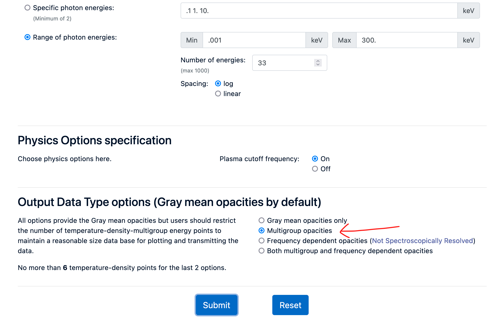
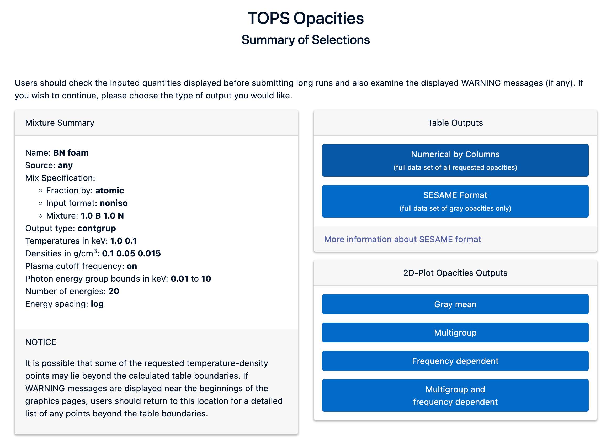

Note: FLASH4.7 now supports use of the .ses file type. However, it is still useful to use this script to extract the .ses easilly from the .ascii file provided by SESAME.

Using SESAME EOS database in FLASH
These are just supplymentary notes. See [opacplot2](https://github.com/flash-center/opacplot2) github for more details.
Note: There was a bug in one the scripts for .tops > .cn4 which I changed. You can install this updated version from [here](https://github.com/PhysicsDan/opacplot2) by running

#### Create a virtual environment and activate it
```
conda create -n opacplot2 python
conda activate opacplot2
```
```
pip install git+https://github.com/PhysicsDan/opacplot2
```
If you do it this way you can just run `sesame-extract` in the terminal.

Otherwise just clone the repo as normal and use the method below.

1) Get access to the [SESAME database](https://www.lanl.gov/org/ddste/aldsc/theoretical/physics-chemistry-materials/sesame-database.php)
2) Search through the sesame.ascii file to find the 'code' for your element
  - I recommend if you're using mac/linux using [less](https://www.tutorialspoint.com/unix_commands/less.htm) because the file is pretty long. You can then search by typing `/boron` and hitting enter to cycle through results. 
  - Note down the number in the row below (it should be 4 digits like 2330 for boron). Type `q` and enter to quit less
3) To extract your EOS from the database you must first use the `sesame_extract.py` script. This will make a *.ses* file which is used in the next step
E.g. 
```
python sesame_extract.py -o boron.ses sesame.ascii 2330
```
4) Now you can use the `opac_convert.py` scipt to create the *.cn4* file
E.g. 
```
python opac_convert.py --Znum 5 -i sesame boron.ses
```
5) You can get opacity data from the [TOPS Opacities](https://aphysics2.lanl.gov/apps/) database. Make sure to select 'Multigroup opacities' and numerical by columns as shown in the images below otherwise the opac_convert 
code won't work. When the webpage with the data appears just save it as a *.html* file. The `opac_convert.py` script can recognise this.

6) Then run the code
```
python opac_convert.py --outname output.cn4 input.html
```




After doing this you can add the .cn4 files to the relavent directories
i.e. `FLASH4.6.2/source/Simulation/SimulationMain/LaserSlab/`
You will also have to update the Config file in this location by adding the line
`DATAFILES my_EOS_file.cn4`
